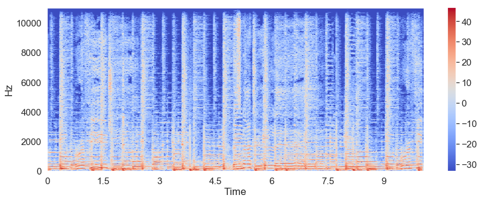
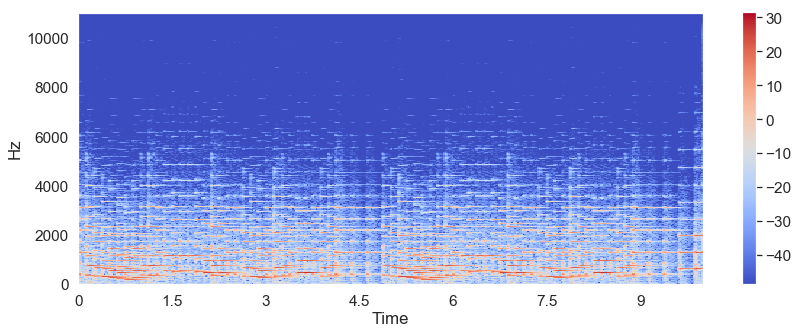

# Evaluation
Genre classification was used to automatically evaluate the  of the generated tunes. The goal was to have as many generated tunes as possible classified as 'folk' music.

## Prerequisites
This portion of the project requires that the following packages be installed
* [Scikit-Learn](https://scikit-learn.org/stable/install.html)
* [LibROSA](https://librosa.github.io/librosa/install.html)

## Data
This project uses the Music Audio Benchmark Dataset curated by researchers at the University of Dortmund which contains 1886 10-second samples obtained from the Garageband website. After balancing the data the dataset that was used for training consists of the following genres
* alternative
* blues
* electronic
* folk
* jazz
* pop
* hiphop
* rock

### Feature Extraction
Although sound is sequential it can be represented in the form of an audio signal having multiple features such as frequency, decibel, zero crossing rate, etc. The features that [Parul Pandey](https://towardsdatascience.com/music-genre-classification-with-python-c714d032f0d8) extracts in her musical genre classification project are the same features extracted here
* zero crossing rate
* spectral centroid
* spectral rolloff
* mel-frequency cepstral coefficients
* chroma features

LiBROSA was used to extract these features from the benchmark dataset as well as from 10-seconds of each of the generated tunes.

### Preprocessing
Along with the data being balanced as previously stated, the data was scaled down between 0 and 1 due to the wide range of values within a single instance. For example, within a single instance, a chroma feature could be equal to 0.151714 with a spectral rolloff of 1863.347.
The normalized data for the generated (gen) music and the original (real) music are saved into csv files (`gen_data_norm_0_1.csv`  and `real_data_norm_0_1.csv` respectively).

## Training
*Note: the validation set is made up of 10% of the Benchmark dataset.*

After training using the Logistic REgression, K-Nearest Neighbor and Gaussian Naive Bayes of the Scikit-Learn library. The logistic regression and gaussian naive bayes algorithms both returned an accuracy of 57.23%. The K-nearest naighbor gave the best accuracy result of approximately 92.73%.

## Testing
When passing the generated data through each of the three models, the accuracy for each was extremely low. By comparing the spectogram of a "real" folk song to that of a generated folk song the difference is clear.

Below is the spectogram of 10 seconds of Refugee by Alex Chu, a folk song within the dataset

Below is the spectogram of 10 seconds a generated folk tune

Spectograms are a visual representation of the spectrum of frequencies of sound as it varies over time. The above spectograms represent the frequencies of only 10-seconds of each song, however the difference is apparent. This could be due to the fact that the "real" songs are not monophonic while the generated tunes are.

## Conclusion
The only way to properly do the automatic evaluation project is to find a dataset of monophonic music in order to train a model suited to the generated tunes.
