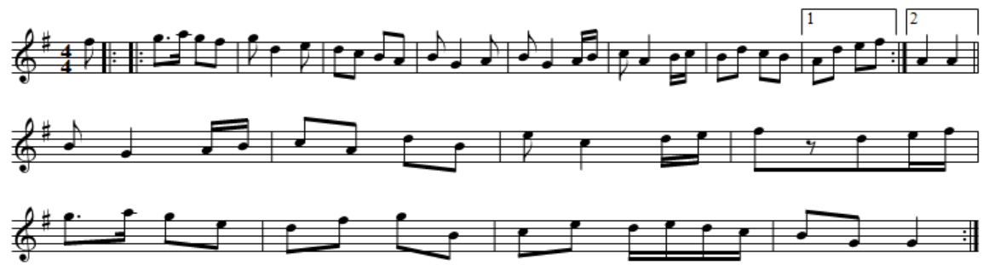
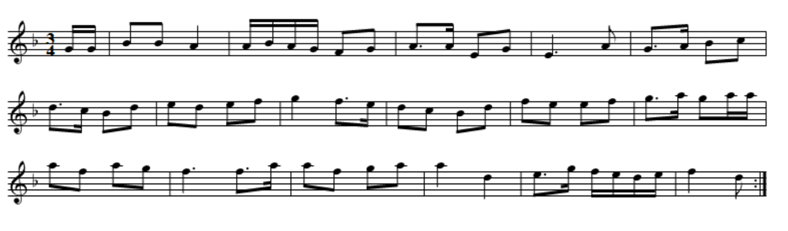

# Music Generation Using Deep Learning
This project involves the implementation of a music generating model trained by a Long Short-Term Memory artificial neural network. The final model generates music which displays characteristics common in that of the folk music genre:

* **monophonic**, a simple melody without any accompanying harmony or chords
* of the **AABB form** (binary form) which represents the repetition of a melody *A* and a melody *B*
* **ends on the tonic**, if the key of a song is in G, the song should end with a G note

Music in general is the result of a sequence of musical notes played and organised within a length of time. In this way, music is structured and sequential, much like natural language, where musical notes are words and measures are sentences.
The final generator is a result of data preparation, data processing, and neural network training, all implemented in Python.

## Prerequisites
This project requires that the following packages be installed
* [PyTorch](https://pytorch.org/get-started/locally/)
* [Scikit-Learn](https://scikit-learn.org/stable/install.html)

## The Data
The dataset that was used for this project was the [Nottingham Database](http://abc.sourceforge.net/NMD/) which contains 1200 monophonic British and American folk tunes all written in [**abc notation**](http://abcnotation.com/). `nottingham_data_prep.py` prepares the data by removing all comments, chords (written between quotation marks), and meta-data excluding the meter *M*, the key *K*, and the tune itslef. An example of a prepared tune is as follows

    M:4/4
    K:G
    f|: || |:g3/2a/2 gf|gd2e|dc BA|BG2A|BG2A/2B/2|\
    cA2B/2c/2|Bd cB| [1Ad ef:|[2A2 A2||
    BG2A/2B/2|cA dB|ec2d/2e/2|fzde/2f/2|
    g3/2a/2 ge|df gB|ce d/2e/2d/2c/2|BG G2:|

Here is what the abc notated text looks like on a traditional music staff

All the tunes are saved in a single file: `nottingham_parsed.txt` in the `datasets/nottingham_database/` directory.

## Training
The LSTM is trained in the `music_train.py` file. `data_proc.py` takes care of all token encoding for the neural network.

### Hyperparameters
All hyperparameters are configured in the `model_configuration.py` file. The hyperparameters that are set were determined by means of a grid search and the best results were chosen by comparing learning curves. The tuned and tested hyperparameters are as follows:
* number of epochs = 100
* number of layers = 3
* number of hidden units = 512
* learning rate = 0.001
* train-validation cut = 0.14
* dropout rate = 0.4

The batch and sequence sizes were chosen by calculating an appropriate value based on the total length of the nottingham dataset.

### Training a model
`model_configuration.py`  can be modified to train a model of your own. 
To train a model execute the following:

    python3 music_train.py [model_name.pth]

If no model file path is provided the model will be saved in the working directory as `model.pth` allong with a log of the the same name and a .png image of the training and validation learning curves.

## Generating Music
Music generation is all implemented in `music_gen.py` . To generate a folk tune, run:

	python3 music_gen.py -m <model_path> [-f file_path] [-p prompt]

`model_path` is the path to the trained model which must be provided in order to generate music. This means that the provided model `./models/musicmodel.pth` must be used or a model must be trained.
`file_path`  is the the path including the name of the file where the tune data will be saved in abc notation. 

### Prompts
`prompt` is what will be fed to the model in order for it to predict the tokens that would most likely follow. By default, it is a predefined end of sequence (eos) token: `</s>`.  However the prompt can be any of the following:
* The eos token `</s>`
* A meter, ex: `M:4/4`
* A meter and a key, ex: `'M:3/4\nK:Dm'` (note the single quotes to acknowledge the newline)

### Execution example
To generate a tune of meter 3/4 and in the D minor key:

	python3 music_gen.py -m ./models/musicmodel.pth -f ./mytune.abc -p 'M:3/4\nK:Dm'

Here is the output, written in abc notation:

    M:3/4
    K:Dm
    G/2G/2|BB A2|A/2B/2A/2G/2 FG|A3/2A/2 EG|E3A|G3/2A/2 Bc|
    d3/2c/2 Bd|ed ef|g2 f3/2e/2|dc Bd|fe ef|\
    g3/2a/2 ga/2a/2|
    af ag|f3 f3/2a/2|af ga|a2 d2|e3/2g/2 f/2e/2d/2e/2|f2 d:|

Here is the generated tune written on a staff:

## Built With
* [EasyABC](https://www.nilsliberg.se/ksp/easyabc/) - Open source ABC editor
* [Direct MIDI to MP3 Converter](https://www.pistonsoft.com/midi2mp3.html) - Used in this project to convert to and from MIDI and WAV audio formats
